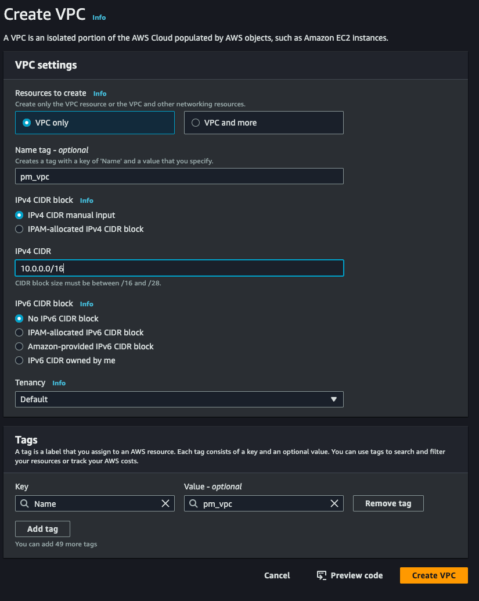

# Project Management App Setup Guide

This guide walks through setting up the database, managing errors, and configuring AWS for your project. Each section provides commands and detailed steps to help you get started.

---

## Database Management

### Resetting the Database

To reset the database, execute the following command:

```bash
npx prisma migrate reset
```

This command erases all existing data and reapplies migrations, resetting the database to a fresh state.

### Inserting Default Data

After resetting the database, populate it with default data by running:

```bash
ts-node prisma/seed.ts
```

This script inserts initial data into the database, providing essential starting information.

---

## Important Error Notes

1. **Default Values**
    - Default values for fields are stored in `server/prisma/seedData`.
    - Use this file to ensure consistent values when updating or adding new seed data.

2. **Auto-Increment Fields**
    - **Do not set values manually for fields marked with `@id @default(autoincrement())`** in `server/prisma/schema.prisma`.
    - Manually setting these fields can lead to errors.

3. **Error Handling in Project Creation**
    - When creating new projects, an error occurs if an ID is manually assigned to an auto-incremented field. The error message may look like:

      ```
      Error creating a project: 
      Invalid prisma.project.create() invocation in
      /path/to/your/project/server/src/controllers/projectController.ts:26:45
      
        23 ): Promise<void> => {
        24   const { name, description, startDate, endDate } = req.body;
        25   try {
      → 26     const newProject = await prisma.project.create(
      Unique constraint failed on the fields: (id)
      ```

    - **Solution**: Ensure auto-incremented fields are not manually assigned in code or seed files.

---

## Running the Application

To start the client and server:

1. **Start the Client**

   ```bash
   cd client
   npm run dev
   ```

2. **Start the Server**

   ```bash
   cd server
   npm run dev
   ```

---

## Updating Dependencies

To upgrade all dependencies to their latest versions, use:

```bash
npx npm-check-updates -u
npm install
```

This updates `package.json` with the latest versions and installs them.

---

## AWS Setup Guide

### Setting Up the AWS Network

#### Step 1: Create a Virtual Private Cloud (VPC)

1. Go to **VPC** in your AWS Console and select **Create VPC**.
2. Refer to the image below for guidance:

   

#### Step 2: Create Subnets

1. Navigate to **VPC > Subnets > Create subnet**.
2. Choose the VPC you created (e.g., `pm_vpc`).
3. Create three subnets as shown below:

    - **Subnet 1**
        - Name: `pm_public-subnet-1`
        - IPv4 CIDR block: `10.0.0.0/24`

    - **Subnet 2**
        - Name: `pm_private-subnet-1`
        - IPv4 CIDR block: `10.0.1.0/24`

    - **Subnet 3**
        - Name: `pm_private-subnet-2`
        - IPv4 CIDR block: `10.0.2.0/24`

4. **Note**: Ensure the Availability Zone matches your country and add multiple subnets if required.

5. For more on CIDR blocks, refer to the [CIDR explanation video](https://youtu.be/KAV8vo7hGAo?si=FUE6BgOziUVqG1eu&t=27250).

#### Step 3: Create an Internet Gateway

1. Go to **VPC > Internet Gateways** and select **Create Internet Gateway**.
2. Create and name the internet gateway, then attach it to your VPC (`pm_vpc`).

    - 
    - 

#### Step 4: Create Route Tables

1. In **VPC > Route tables**, create three route tables:

    - Name: `pm_public-route-table-1`
    - Name: `pm_private-route-table-1`
    - Name: `pm_private-route-table-2`

2. Associate each route table with the corresponding subnet:

    - **Public Route Table**
        - Route Table: `pm_public-route-table-1`
        - Subnet Association: `pm_public-subnet-1`

    - **Private Route Table 1**
        - Route Table: `pm_private-route-table-1`
        - Subnet Association: `pm_private-subnet-1`

    - **Private Route Table 2**
        - Route Table: `pm_private-route-table-2`
        - Subnet Association: `pm_private-subnet-2`

3. Edit the routes in `pm_public-route-table-1` to allow internet access:

    - 
    - 

---

For a full visual guide, refer to the [video tutorial](https://youtu.be/KAV8vo7hGAo?si=adrniPdbONkLQQQ9&t=20604).